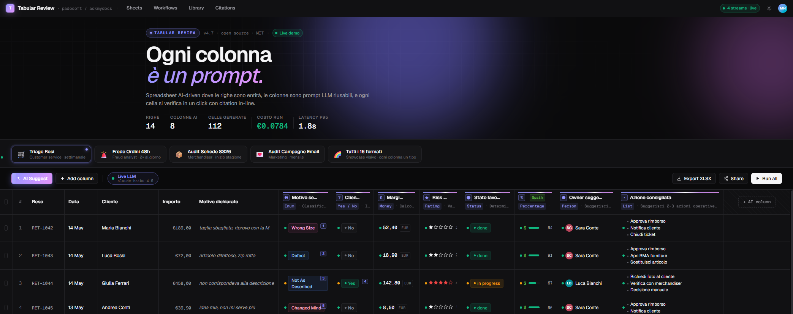
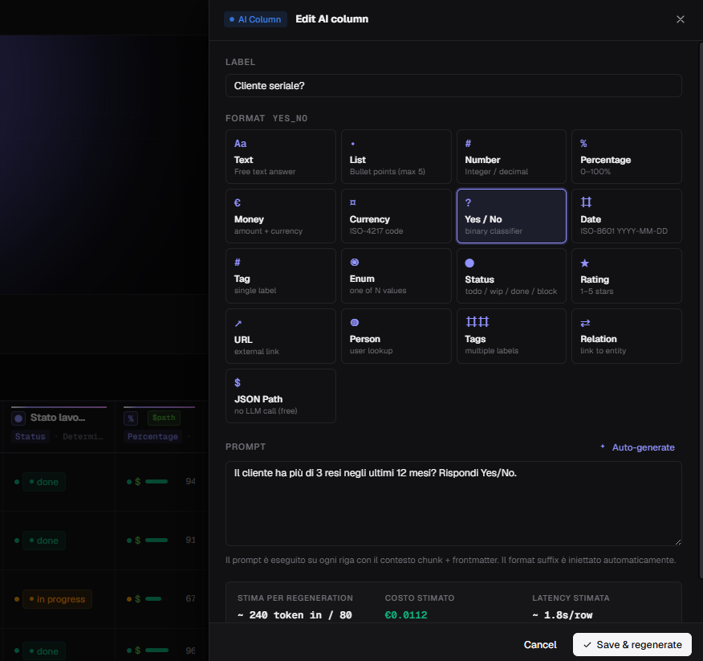
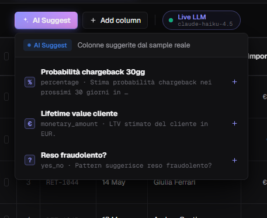

<div align="center">

# 🧠 Spreadsheet‑AI — The Agentic Grid

### *Every column is a prompt. Every cell is verifiable in one click.*

A production‑style demo of **Tabular Review 2.0**: a spreadsheet where **rows are
business entities**, **columns are reusable LLM prompts**, and **cells are AI
answers** with a confidence flag and an inline citation — streamed in live,
cell‑by‑cell.

[](https://github.com/lopadova/spreadsheet-ai/actions/workflows/ci.yml)
[](LICENSE)




</div>

---

## Table of Contents

- [The idea — a row of dominoes](#the-idea--a-row-of-dominoes)
- [What makes it special](#what-makes-it-special)
- [Screenshots](#screenshots)
- [The 17 column formats](#the-17-column-formats)
- [Architecture](#architecture)
- [Quickstart (junior‑proof, step by step)](#quickstart-juniorproof-step-by-step)
- [Going Live (real LLM)](#going-live-real-llm)
- [Demo data & presets](#demo-data--presets)
- [Testing & CI](#testing--ci)
- [Credits — MikeOSS](#credits--mikeoss)
- [License](#license)

---

## The idea — a row of dominoes

The pattern comes from **[MikeOSS](https://mikeoss.com/)**' *Tabular Review*: a
grid where **rows are documents** and **columns are AI prompts**, built for the
**legal** vertical (NDAs, M&A, due‑diligence checklists).

Looking at it, a row of dominoes fell: **the pattern isn't legal — it's
back‑office triage.** It works *identically* for any role that screens the same
kind of rows over and over:

- **Customer service** triaging 50 returns every Monday → *semantic reason, serial customer?, item margin, refundable?, fraud risk 1–5*.
- **Merchandiser** auditing 2000 product cards each season → *description complete?, SEO score, alt‑text ok?, suggested tags, missing translations*.
- **Fraud analyst** screening 200 suspicious orders every 48h → *fraud risk, address anomaly, blacklist match, recommended action, confidence*.
- **Marketing** auditing 50 email campaigns a month → *CTR effectiveness, subject ok?, audience ok?, best segment, suggested optimization*.

The old back‑office (DataTables + opening records one by one + Excel on the side)
is obsolete. The **new** back‑office is an AI‑driven spreadsheet where every
column is a reusable prompt and every cell is verifiable in one click. This repo
is that idea, **generalized beyond legal** and built on a stack anyone can adopt.

> *Adapt, don't adopt.*

## What makes it special

- **🧩 Each column is a prompt.** Click a column to edit its label / format / natural‑language prompt, then regenerate just that column.
- **🎨 17 column formats** (vs Mike's 9) — text, list, number, %, money, currency, yes/no, date, tag, **enum**, **enum_status**, **rating**, **url**, **person**, **tags_multi**, **relation**, and **`json_path`**.
- **⚡ `json_path` = zero‑LLM bypass.** When the value is already in the row's structured data, it's resolved directly — **free, instant**, no model call.
- **💸 Cost is `O(rows)`, not `O(rows × cols)`.** One batched call per row returns one JSON line per column.
- **📺 Live cell‑by‑cell streaming** over Server‑Sent Events: watch the grid fill in, skeleton → value, with a progress bar.
- **🖼️ Canvas grid (Glide Data Grid)** — smooth to 100k+ rows, where a DOM grid plateaus at ~500.
- **✨ AI Suggest** proposes columns tailored to the active scenario.
- **🔎 Citation side‑panel, bulk regenerate, human‑readable confidence dots.**
- **🟢 Runs out‑of‑the‑box in Mock mode** — zero API keys, fully deterministic — then flip a switch for real LLM calls via the **`laravel/ai`** SDK.

## Screenshots

| Agentic grid (hero) | Edit a column's prompt | AI Suggest |
|---|---|---|
|  |  |  |

## The 17 column formats

`text` · `bulleted_list` · `number` · `percentage` · `monetary_amount` ·
`currency` · `yes_no` · `date` · `tag` · `enum` · `enum_status` · `rating` ·
`url` · `person` · `tags_multi` · `relation` · `json_path` *(LLM‑free)*.

The **🌈 Tutti i 16 formati** preset renders every one of them at once.

## Architecture

Three deliberate decisions keep this a clonable, zero‑setup demo:

1. **SQLite** (`database/database.sqlite`) — rows are seeded e‑commerce entities; no embeddings/pgvector needed (the LLM context is the row itself).
2. **Synchronous SSE** — the stream endpoint iterates rows, calls the extractor, and echoes `cell` events as they land. No Redis/Horizon.
3. **Mock mode by default + a Live toggle** — works offline; flip to real `laravel/ai` (Anthropic `claude-haiku-4.5`) when you add a key.

**Stack:** Laravel 13 · PHP 8.3+ · `laravel/ai` · SQLite — and React 19 · Vite 8 ·
Tailwind v4 · `@glideapps/glide-data-grid` · TanStack Query.

```
Browser (React 19)                         Laravel 13
┌───────────────────────────┐  GET /api    ┌───────────────────────────────┐
│ Glide canvas grid          │ ───────────▶ │ ReviewHydrator → preset rows  │
│ 17 cell renderers          │              │ + columns + existing cells    │
│ EventSource (SSE consumer) │ ◀─ cell ──── │ StreamController (text/event- │
│ TanStack Query + store     │   events     │ stream) → TabularReviewExtractor
└───────────────────────────┘              │   ├─ json_path → resolve (free)│
                                            │   └─ LLM → batched JSON-lines  │
                                            │        via laravel/ai (or Mock)│
                                            └───────────────────────────────┘
```

## Quickstart (junior‑proof, step by step)

> Prereqs: **PHP 8.3+**, **Composer**, **Node 20+** & **npm**. (On Windows, [Laravel Herd](https://herd.laravel.com/) gives you PHP + Composer in one click.)

```bash
# 1. Clone
git clone https://github.com/lopadova/spreadsheet-ai.git
cd spreadsheet-ai

# 2. Install backend + frontend dependencies
composer install
npm install

# 3. Create your env + app key + the SQLite database file
cp .env.example .env          # Windows: copy .env.example .env
php artisan key:generate
#   (the DB defaults to SQLite at database/database.sqlite)

# 4. Create the schema and load the demo data (returns, orders, articles, campaigns)
php artisan migrate:fresh --seed

# 5a. Build the frontend, then serve the app
npm run build
php artisan serve
#   → open http://127.0.0.1:8000
#
# 5b. …or for live frontend reload, run Vite + the server in two terminals:
#   Terminal 1:  php artisan serve
#   Terminal 2:  npm run dev
```

Then, in the browser:

1. Pick a scenario **chip** at the top (🛒 Triage Resi, 🚨 Frode Ordini, 📦 Audit Schede, 💌 Audit Campagne, 🌈 Tutti i 16 formati).
2. Click **Run all** — watch the cells stream in, skeleton → value, with confidence dots and citations.
3. Click an AI **column header** (✎) to edit its prompt/format, then **Save & regenerate** that column.
4. Click **✨ AI Suggest** to add a tailored column, or **Add column** to write your own.
5. Click any cell to open the **citation side‑panel**; select columns and use **Regenerate selected**; or **Export CSV**.

It all works in **Mock mode** with **no API key**.

## Going Live (real LLM)

Mock mode is the default. To use real model calls via `laravel/ai`:

```dotenv
# .env
TABULAR_AI_MOCK=false
TABULAR_AI_PROVIDER=anthropic
TABULAR_AI_MODEL=claude-haiku-4-5
ANTHROPIC_API_KEY=sk-ant-...
```

The extractor then issues **one batched call per row** (JSON‑lines, one object per
column); `json_path` columns never call the model.

## Demo data & presets

`php artisan migrate:fresh --seed` loads a small e‑commerce dataset (customers,
articles, orders, order items, returns, email campaigns) plus 5 built‑in
workflows — the exact rows behind the cooked Mock answers, so the demo looks
identical with or without a key. Seeders are gated to `local`/`testing`.

## Testing & CI

```bash
composer validate --strict
vendor/bin/phpunit      # backend (PHPUnit)
npm run typecheck       # TypeScript
npm run test            # frontend units (Vitest)
npm run build           # Vite build
npm run e2e             # Playwright (run `npm run build` + migrate:fresh --seed first)
```

Every pull request runs the full gate in **GitHub Actions**
(`.github/workflows/ci.yml`): composer validate → phpunit → typecheck → vitest →
build → Playwright (chromium, seeded SQLite).

## Credits — MikeOSS

The **Tabular Review** pattern was created by **[MikeOSS](https://mikeoss.com/)**
([repo](https://github.com/willchen96/mike), **AGPL‑3.0**) for the legal vertical.
This project is an **independent re‑implementation that generalizes the pattern**
beyond legal, written from scratch on a different stack (Laravel + React, not
Mike's), adding `json_path`, AI‑suggest, more formats, and a canvas grid. MikeOSS
showed the way — **credit where it's due.** *Adapt, don't adopt.*

Thanks also to **[Glide Apps](https://github.com/glideapps/glide-data-grid)** for
the data grid and the **Laravel** + **React** communities.

## License

This repository is licensed under **Apache‑2.0** (see [`LICENSE`](LICENSE)).
MikeOSS, the inspiration, is **AGPL‑3.0** — this is a clean‑room generalization,
not a fork.
